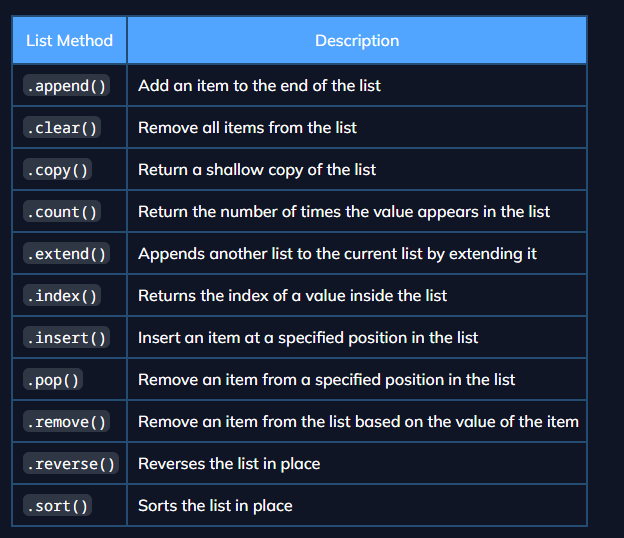

# Pontos relevantes do Python

#### Diferenças entre python e outras linguagens para os dados primitivos:

No python, não existe o "char" **(para um único caractere)**, para o python, qualquer caractere inserido é tido como **string** de comprimento 1. Ou seja, por ser **tipado dinamicamente** o tipo do dado é atribuído assim que você informa o valor da variável. Porém se for **reatribuída**, ela pode mudar de tipo. 

Por isso, ela não é um *typesafe* como o Java ou C, ao qual você precisa informar que a variável criada só pode receber dados do tipo "x". Ele compreende o tipo do dado conforme o valor da variável.

    X = 5 (A variável é um inteiro)
    X = "5" (A variável mudou o tipo de dados de inteiro para string)

Pois para o Python, o que vai definir o tipo de uma variável é o valor que ela recebe. Porém, se o seu código precisar que o valor recebido por uma variável seja de um determinado tipo, faz sentido você "forçar" ela a receber somente um tipo de dado
    
    X = int(5.5)

Com isso, o valor que irá aparecer, se printado, será somente o valor inteiro. Pois, independente do valor que estiver dentro do parâmetro do construtor INT

###### O int funciona como uma função, mas é um construtor de tipo. Ou seja, ele cria um objeto do tipo  inteiro a partir do valor fornecido e uma função é algo que realiza uma ação ou cálculo, geralmente criado em um bloco de código a partir da palavra-chave **def**.

sobre listas: métodos de lista
